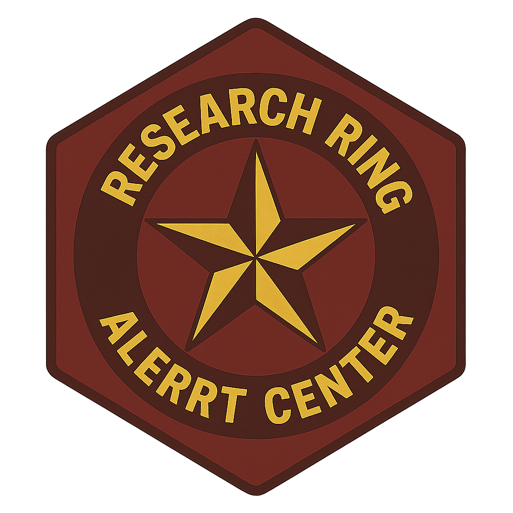

::: {.rr-hero}

## Research at the Heart of ALERRT

The Research Ring is the research division of the [ALERRT Center](https://alerrt.org/){target="_blank"} at Texas State University. We produce rigorous, evidence-based research to support the nation's standard in active shooter response training — and to improve the health and operational capacity of first responders.

:::

:::::: columns
::: {.column width="60%"}
The Research Ring supports the mission of the ALERRT Center to "...**provide the best *research-based* active shooter response training in the nation"** by producing research and other resources.

Within the ALERRT Center, our mandate is to improve the lives and operational capacity of first responders through rigorous research and evaluation. Our research covers several topic areas:

- Active attack trends
- Law enforcement training
- First responder health/wellness
- Public/law enforcement opinion
:::

::: {.column width="10%"}
:::

::: {.column width="30%"}

:::
::::::

### Active Attacks

:::::: columns
::: {.column width="60%"}

At its core, the ALERRT Center is focused on preparing law enforcement and other first responders to respond to active attacks. Understanding the trends and commonalities between active attacks and how they change over time is critically important to this effort. The Research Ring maintains a database of active attacks that have occurred in the United States since 2000. We also host the website, [ActiveAttackData.org](https://activeattackdata.org/){target="_blank"}, to make that database publicly accessible. Visitors will find resources (static/interactive plots, maps, etc.) that unpack the data. Or visitors can download the data directly from the website as well. All of the media is downloadable and free to use.
:::

::: {.column width="10%"}
:::

::: {.column width="30%"}

:::
::::::
