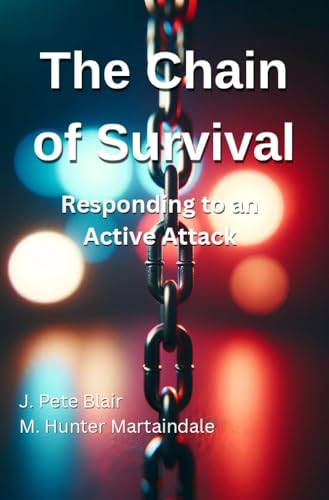
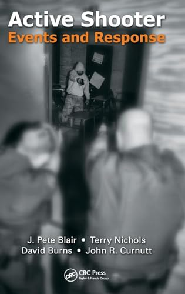
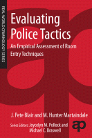
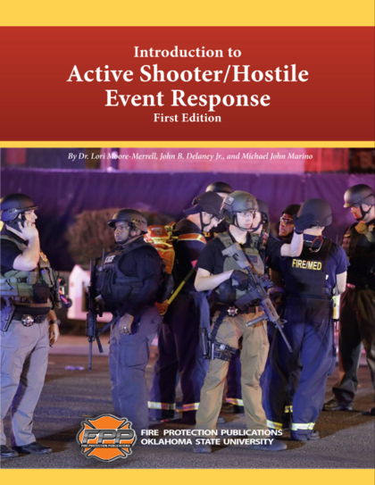

Below are books, book chapters, and public reports produced by members of the ALERRT Research Ring.

## Books

### The Chain of Survival: Responding to an Active Attack

:::::: columns
::: {.column width="60%"}
Blair, J. P., & Martaindale, M. H. (2024). *The Chain of Survival: Responding to an Active Attack.* TPPP, LLC.

This book presents a five-link framework for improving responses to active attack events, covering civilian response, law enforcement response, stabilization, transport, and definitive care. Drawing on resilience engineering theory and operational experience, the authors equip both civilians and first responders with strategies to anticipate, monitor, and respond effectively to attacks with the goal of minimizing casualties.
:::

::: {.column width="10%"}
:::

::: {.column width="30%"}
[{.rr-book-cover}](https://www.amazon.com/Chain-Survival-Responding-Active-Attack/dp/B0DFS3K8P8){target="_blank"}
:::
::::::

---

### Active Shooter Events and Response

:::::: columns
::: {.column width="60%"}
Blair, J. P., Nichols, T., Burns, D., & Curnutt, J. R. (2013). *Active Shooter Events and Response.* CRC Press LLC.

This textbook provides a comprehensive examination of active shooter events in the United States from 2000 to 2010, covering the historical context of these incidents, their increasing complexity, and how law enforcement response has evolved. Topics include event preparation, stopping the killing, room entry and threat confrontation, and civilian response — drawing on ALERRT's extensive training and research experience.
:::

::: {.column width="10%"}
:::

::: {.column width="30%"}
[{.rr-book-cover}](https://www.routledge.com/Active-Shooter-Events-and-Response/Blair-Nichols-Burns-Curnutt/p/book/9781466512290){target="_blank"}
:::
::::::

---

### Evaluating Police Tactics: An Empirical Assessment of Room Entry Techniques

:::::: columns
::: {.column width="60%"}
Blair, J. P., & Martaindale, M. H. (2013). *Evaluating police tactics: an empirical assessment of room entry techniques.* Elsevier.

Based on five experiments conducted over two years, this work challenges conventional wisdom about police room entry tactics by systematically assessing current philosophies and techniques. It offers evidence-based recommendations for how patrol officers can safely and effectively enter scenes of ongoing violence, locate a shooter, and stop the threat.
:::

::: {.column width="10%"}
:::

::: {.column width="30%"}
[{.rr-book-cover}](https://www.routledge.com/Evaluating-Police-Tactics-An-Empirical-Assessment-of-Room-Entry-Techniques/Blair-Martaindale/p/book/9780323280662){target="_blank"}
:::
::::::

---

## Book Chapters

### Active Shooter/Hostile Event Overview (Data)

:::::: columns
::: {.column width="60%"}
Martaindale, M. H. (2021). Active Shooter/Hostile Event Overview (Data). In *Introduction to Active Shooter/Hostile Event Response.* Fire Protection Publications, Oklahoma State University.

This chapter provides a data-driven overview of active shooter and hostile event incidents in the United States, drawing on the ALERRT Center's comprehensive event database. It contextualizes the scope, nature, and trends of these events to inform the training and response frameworks presented throughout the volume.
:::

::: {.column width="10%"}
:::

::: {.column width="30%"}
[{.rr-book-cover}](https://www.amazon.com/Introduction-Active-Shooter-Hostile-Response/dp/0879397322){target="_blank"}
:::
::::::

---

## Reports

### Robb Elementary School, Uvalde, Texas — After Action Report (2022)

:::::: columns
::: {.column width="60%"}
Following the 2022 attack at Robb Elementary School in Uvalde, Texas, the ALERRT Center produced an after action report documenting all key details of the attack and the law enforcement response. The report also provided recommendations for preventing such attacks and improving response effectiveness in the future.
:::

::: {.column width="10%"}
:::

::: {.column width="30%"}
[{.rr-book-cover}](resources/reports/report_2022_uvalde_aar.pdf){target="_blank"}
:::
::::::
